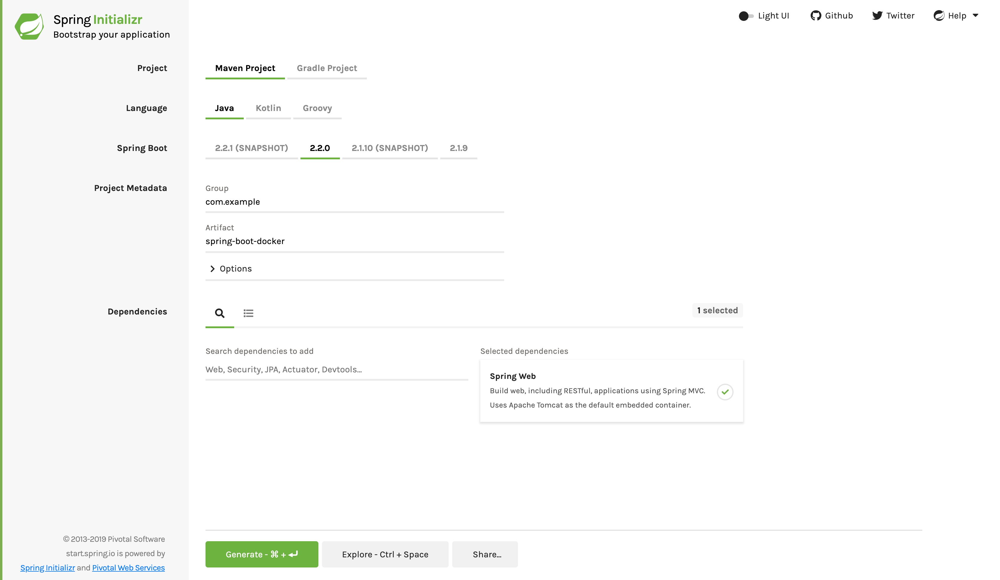

:spring_version: current
:toc:
:project_id: gs-spring-boot-docker
:icons: font
:source-highlighter: prettify

This guide walks you through the process of building a https://docker.com[Docker] image to
run a Spring Boot application.

== What You Will Build

https://docker.com[Docker] is a Linux container management toolkit with a "`social`"
aspect, letting users publish container images and consume those published by others. A
Docker image is a recipe for running a containerized process. In this guide, we will build
one for a simple Spring boot application.

NOTE: There is also a
https://spring.io/guides/topicals/spring-boot-docker[Topical Guide on Docker], which
covers a wider range of choices than we have here -- and in much more detail.

== What You Need

:java_version: 1.8
include::https://raw.githubusercontent.com/spring-guides/getting-started-macros/master/prereq_editor_jdk_buildtools.adoc[]

If you are not using a Linux machine, you will need a virtualized server. By installing
VirtualBox, other tools (such as the Mac's boot2docker) can seamlessly manage it for you.
Visit https://www.virtualbox.org/wiki/Downloads[VirtualBox's download site] and pick the
version for your machine. Download and install. Do not worry about actually running it.

You will also need https://docker.com[Docker], which only runs on 64-bit machines. See
https://docs.docker.com/installation/#installation for details on setting Docker up for
your machine. Before proceeding further, verify you can run `docker` commands from the
shell. If you are using boot2docker you need to run that first.

include::https://raw.githubusercontent.com/spring-guides/getting-started-macros/master/how_to_complete_this_guide.adoc[]

[[scratch]]
== Starting with Spring Initializr

For all Spring applications, you should start with the https://start.spring.io[Spring
Initializr]. The Initializr offers a fast way to pull in all the dependencies you need for
an application and does a lot of the setup for you. This example needs only the Spring Web
dependency. The following image shows the Initializr set up for this sample project:



NOTE: The preceding image shows the Initializr with Maven chosen as the build tool. You
can also use Gradle. It also shows values of `com.example` and `spring-boot-docker` as the
Group and Artifact, respectively. You will use those values throughout the rest of this
sample.

The following listing shows the `pom.xml` file that is created when you choose Maven:

====
[source,xml]
----
include::initial/pom.xml[]
----
====

The following listing shows the `build.gradle` file that is created when you choose Gradle:

====
[source,text]
----
include::initial/build.gradle[]
----
====

[[initial]]
== Set up a Spring Boot Application

Now you can create a simple application. The following listing (from
`src/main/java/com/example/springbootdocker/SpringBootDockerApplication.java`) shows the
application (which consists of only one class):

====
[source,java]
----
include::complete/src/main/java/com/example/springbootdocker/SpringBootDockerApplication.java[]
----
====

The class is flagged as a `@SpringBootApplication` and as a `@RestController`, meaning it
is ready for use by Spring MVC to handle web requests. `@RequestMapping` maps `/` to the
`home()` method, which sends a "`Hello, Docker World`" response.  The `main()` method uses
Spring Boot's `SpringApplication.run()` method to launch an application.

Now we can run the application without the Docker container (that is, in the host OS).

If you use Gradle, run the following command (in the `complete` directory):

====
[subs="attributes"]
----
./gradlew bootRun
----
====

If you use Maven, run the following command (in the `complete` directory):

====
[subs="attributes"]
----
./mvnw spring-boot:run
----
====

Then go to http://localhost:8080[localhost:8080] to see your "`Hello, Docker World`"
message.

== Containerize the Application

Docker has a simple https://docs.docker.com/reference/builder/["`Dockerfile`"] file format
that it uses to specify the "`layers`" of an image. Create a Dockerfile in your Spring
Boot project. It should match the following listing:

====
[source]
----
FROM openjdk:8-jdk-alpine
ARG JAR_FILE=target/*.jar
COPY ${JAR_FILE} app.jar
ENTRYPOINT ["java","-jar","/app.jar"]
----
====


You can run it with Maven by using the following command:

====
[source,bash]
----
$ docker build -t springio/gs-spring-boot-docker .
----
====

You can run it with Gradle by using the following command:

====
[source,bash]
----
$ docker build --build-arg JAR_FILE=build/libs/*.jar -t springio/gs-spring-boot-docker .
----
====

This command builds an image and tags it as `springio/gs-spring-boot-docker`.

This Dockerfile is simple, but it is all you need to run a Spring Boot application with no
frills: only Java and a JAR file. The project JAR file is added to the container as
`app.jar` and then run in the `ENTRYPOINT`. The array form of the Dockerfile `ENTRYPOINT`
is used so that there is no shell wrapping the java process. The
https://spring.io/guides/topicals/spring-boot-docker[Topical Guide on Docker] goes into
this topic in more detail.

NOTE: We added a `VOLUME` pointing to `/tmp`, because that is where a Spring Boot
application, by default, creates working directories for Tomcat. The effect is to create a
temporary file on your host under `/var/lib/docker` and link it to the container under
`/tmp`. This step is optional for the simple application that we wrote here, but it can be
necessary for other Spring Boot applications if they need to actually write to the
filesystem.

NOTE: To reduce
http://wiki.apache.org/tomcat/HowTo/FasterStartUp#Entropy_Source[Tomcat startup time], we
added a system property that points to `/dev/urandom` as a source of entropy. This is not
necessary with more recent versions of Spring Boot, if you use the "`standard`" version of
Tomcat (or any other web server).

To take advantage of the clean separation between dependencies and application resources
in a Spring Boot fat jar file, we will use a slightly different implementation of the
Dockerfile, as the following listing (from `complete/Dockerfile`) shows:

====
[source]
----
include::complete/Dockerfile[]
----
====

This Dockerfile has a `DEPENDENCY` parameter pointing to a directory where we have unpacked the fat jar.

With Maven, you can build with this dependency by using the following command:

====
[source,bash]
----
$ mkdir -p target/dependency && (cd target/dependency; jar -xf ../*.jar)
----
====

With Gradle, you can build with this dependency by using the following command:

====
[source,bash]
----
$ mkdir -p build/dependency && (cd build/dependency; jar -xf ../libs/*.jar)
----
====

It already contains a `BOOT-INF/lib` directory with the dependency
jars in it and a `BOOT-INF/classes` directory with the application classes in it. Notice
that we are using the application's own main class
(`com.example.springbootdocker.SpringBootDockerApplication`). This is faster than using
the indirection provided by the fat jar launcher.

NOTE: Exploding the jar file can result in the classpath order being different at runtime.
A well-behaved and well-written application should not care about this, but you may see
behavior changes if the dependencies are not carefully managed.

NOTE: If you use boot2docker, you need to run it first before you do anything with the
Docker command line or with the build tools (it runs a daemon process that handles the
work for you in a virtual machine).

To build the image you can use the Docker command line, as follows:

====
[source,bash]
----
docker build -t springio/gs-spring-boot-docker .
----
====

From a Gradle build, you can add the explicit build args, as follows:

====
[source,bash]
----
docker build --build-arg DEPENDENCY=build/dependency -t springio/gs-spring-boot-docker .
----
====

TIP: If you used only Gradle, you could change the Dockerfile to make the default value of
`DEPENDENCY` match the location of the unpacked archive.

Instead of building with the Docker command line, you might want to use a build plugin.
Google has an open source tool called Jib that has Maven and Gradle plugins. Probably the
most interesting thing about it is that you do not need docker -- it builds the image by
using the same standard output as you get from `docker build` but does not use `docker`
unless you ask it to. As a result it works in environments where Docker is not installed
(not uncommon in build servers).

=== Build a Docker Image with Maven

To get started quickly, you can run Jib without even changing your `pom.xml` file, as
follows:

====
[source,bash]
----
./mvnw com.google.cloud.tools:jib-maven-plugin:dockerBuild -Dimage=springio/gs-spring-boot-docker
----
====

To push to a Docker registry, you can use the `build` goal, instead of `dockerBuild`, as follows:

====
[source,bash]
----
./mvnw com.google.cloud.tools:jib-maven-plugin:build -Dimage=springio/gs-spring-boot-docker
----
====

To do that, you need to have permission to push to Dockerhub, which you do not have by
default. Change the image prefix to your own Dockerhub ID and change `docker login` to
make sure you are authenticated before you run Maven.


=== Build a Docker Image with Gradle

If you use Gradle, you need to add a new plugin, as the following listing shows:

====
[source,groovy]
----
plugins {
  ...
  id 'com.google.cloud.tools.jib' version '1.8.0'
}
----
====

If you prefer the older style used in the Getting Started Guides, you can do the following:

====
[source,groovy]
----
buildscript {
    repositories {
      maven {
        url "https://plugins.gradle.org/m2/"
      }
      mavenCentral()
    }
    dependencies {
        classpath('org.springframework.boot:spring-boot-gradle-plugin:2.2.1.RELEASE')
include::complete/build.gradle[tag=build]
    }
}
include::complete/build.gradle[tag=plugin]
----
====

The following listing (from `complete/build.gradle`) shows the finished Gradle build file:

====
[source,xml]
----
include::complete/build.gradle[]
----
====

You can build a tagged docker image with Gradle in one command:

```
$ ./gradlew jibDockerBuild --image=springio/gs-spring-boot-docker
```

As with the Maven build, there is also a build task to build and push to the Docker registry:

```
$ ./gradlew jib --image=springio/gs-spring-boot-docker
```

If you have authenticated with `docker` on the command line, the image push will authenticate from your local `~/.docker` configuration.

=== After the Push

A "docker push" (or build plugin with "jib") in the example will fail for you (unless you are part of the "springio" organization at Dockerhub), but if you change the configuration to match your own docker ID then it should succeed, and you will have a new tagged, deployed image.

[TIP]
=====
You need not register with docker or publish anything to run a docker image that was built locally. If you built with Docker (from the command line or from Jib), you still have a locally tagged image, and you can run it as follows:

====
----
$ docker run -p 8080:8080 -t springio/gs-spring-boot-docker
....
2015-03-31 13:25:48.035  INFO 1 --- [           main] s.b.c.e.t.TomcatEmbeddedServletContainer : Tomcat started on port(s): 8080 (http)
2015-03-31 13:25:48.037  INFO 1 --- [           main] c.e.s.Application                        : Started Application in 5.613 seconds (JVM running for 7.293)
----
====

The application is then available on http://localhost:8080 (visit that and it says "Hello, Docker World").
=====

[NOTE]
=====
When using a Macbook with boot2docker, you typically see things such as the following at
startup:

====
[source]
----
Docker client to the Docker daemon, please set:
    export DOCKER_CERT_PATH=/Users/gturnquist/.boot2docker/certs/boot2docker-vm
    export DOCKER_TLS_VERIFY=1
    export DOCKER_HOST=tcp://192.168.59.103:2376
----
====

To see the app, you must visit the IP address in DOCKER_HOST instead of localhost. In this case,
http://192.168.59.103:8080 (the public facing IP of the VM).
=====

When it is running, you can see in the list of containers, as shown in the following
example:

====
[source]
----
$ docker ps
CONTAINER ID        IMAGE                                   COMMAND                  CREATED             STATUS              PORTS                    NAMES
81c723d22865        springio/gs-spring-boot-docker:latest   "java -Djava.secur..."   34 seconds ago      Up 33 seconds       0.0.0.0:8080->8080/tcp   goofy_brown
----
====

To shut it down, run `docker stop` with the container ID from the preceding listing (yours
will be different), as shown in the following example:

====
[source]
----
$ docker stop goofy_brown
81c723d22865
----
====

You can also delete the container (it is persisted in your filesystem somewhere under
`/var/lib/docker`) when you are finished with it, as the follwoing example shows:

====
[source]
----
$ docker rm goofy_brown
----
====

=== Using Spring Profiles

Running your freshly minted Docker image with Spring profiles is as easy as passing an
environment variable to the Docker run command, as the following examples show:

====
[source]
----
$ docker run -e "SPRING_PROFILES_ACTIVE=prod" -p 8080:8080 -t springio/gs-spring-boot-docker
----

----
$ docker run -e "SPRING_PROFILES_ACTIVE=dev" -p 8080:8080 -t springio/gs-spring-boot-docker
----
====

=== Debugging the Application in a Docker Container

To debug the application, you can use
http://docs.oracle.com/javase/8/docs/technotes/guides/jpda/conninv.html#Invocation[JPDA Transport].
Doing so treats the container like a remote server. To enable this feature, pass a Java
agent setting in the JAVA_OPTS variable and map the agent's port to localhost during a
container run. With https://www.docker.com/products/docker#/mac[Docker for Mac], there is
a limitation because we cannot access container by IP without
https://github.com/docker/for-mac/issues/171[additional work]. The following example shows
a command that debugs a Spring Boot Docker instance:

====
[source]
----
$ docker run -e "JAVA_TOOL_OPTIONS=-agentlib:jdwp=transport=dt_socket,address=5005,server=y,suspend=n" -p 8080:8080 -p 5005:5005 -t springio/gs-spring-boot-docker
----
====

== Summary

Congratulations! You created a Docker container for a Spring Boot application! By default,
Spring Boot applications run on port 8080 inside the container, and we mapped that to the
same port on the host using `-p` on the command line.

== See Also

The following guides may also be helpful:

* https://spring.io/guides/gs/serving-web-content/[Serving Web Content with Spring MVC]
* https://spring.io/guides/gs/spring-boot/[Building an Application with Spring Boot]
* https://spring.io/guides/topicals/spring-boot-docker[Topical Guide on Spring Boot with Docker] (more depth than this guide)

include::https://raw.githubusercontent.com/spring-guides/getting-started-macros/master/footer.adoc[]
